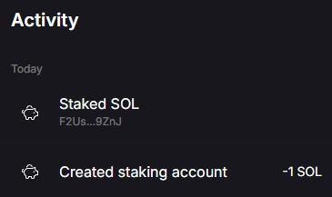

# Rust代码质押solana委托投票权给验证者

首先要创建一个质押账户，并转入要质押的SOL，对标 `solana create-stake-account` cli 的功能

```rust
let staker = Keypair::new();
let authorized = stake::state::Authorized {
    staker: staker.pubkey(),
    withdrawer: staker.pubkey(),
};
let lockup = stake::state::Lockup {
    unix_timestamp: unsafe { libc::time(std::ptr::null_mut()) },
    epoch: 0,
    custodian: staker.pubkey(),
};
let lamports = 10u64.pow(9);
let ixs = stake::instruction::create_account( // stake::program::id();
    &payer.pubkey(),
    &staker.pubkey(),
    &authorized,
    &lockup,
    lamports,
);
let transaction = Transaction::new_signed_with_payer(&ixs, Some(&payer.pubkey()), &[&staker], blockhash);
let txhash = client.send_and_confirm_transaction(&transaction).unwrap();
```

注意创建完质押账户并不能获得奖励，就像我以前以为质押JUP获得JUP打新奖励，结果JUP要求行使了投票权的质押者才能获得奖励。

所以我们的质押账户必须要行使投票权，例如投票/验证solana网络最新区块的某个交易是否正确，给网络做出贡献才能获得质押奖励

当然我不是验证者，或者懒得投票，这时候可以将质押账户的SOL对应的投票权益，委托给验证者节点进行投票以此获得奖励

通过 solana validators 查询当前所有验证者节点然后选其中一个 vote addr 投票地址即可

为了网络稳定，质押/解除质押1个SOL不会立即获得1SOL同等的投票权力，质押后会随着时间增加投票权力直到1个SOL的完整投票权力，解除质押也是慢慢解除，这样避免大户突然质押或者取消质押大量资金造成solana网络投票权力的不稳定

质押账户创建完之后，对标 `solana delate-stake` cli 的功能进行质押委托

```rust
let ix = stake::instruction::delegate_stake(
    &staker.pubkey(),
    &staker.pubkey(),
    &solana_sdk::pubkey!("F2UsSsRHezY1U4h8FWMmWHkgyVd8r5hVVPNXViod9ZnJ"),
);
let transaction = Transaction::new_signed_with_payer(
    &vec![ix],
    Some(&payer.pubkey()),
    &[&payer, &staker],
    blockhash,
);
let txhash = client.send_and_confirm_transaction(&transaction).unwrap();
println!("{txhash}");
```

质押的tx成功后，可以命令行查询当前质押账户的状态，如果想要赎回质押的钱，可以 `solana deactivate-stake`

```
w@w:~$ p solana stake-account BYMscUVgenNz6kaRsBuyG2WroXtkE8LyX2yZoq9uvX4W
ProxyChains-3.1 (http://proxychains.sf.net)
Balance: 1 SOL
Rent Exempt Reserve: 0.00228288 SOL
Delegated Stake: 0.99771712 SOL
Active Stake: 0 SOL
Activating Stake: 0.99771712 SOL
Stake activates starting from epoch: 736
Delegated Vote Account Address: F2UsSsRHezY1U4h8FWMmWHkgyVd8r5hVVPNXViod9ZnJ
Stake Authority: BYMscUVgenNz6kaRsBuyG2WroXtkE8LyX2yZoq9uvX4W
Withdraw Authority: BYMscUVgenNz6kaRsBuyG2WroXtkE8LyX2yZoq9uvX4W
```

或者在 solflare 之类的钱包就看到质押记录了




```
solana-keygen new --outfile stake-account-keypair.json
solana create-stake-account stake-account-keypair.json 1 SOL
solana delegate-stake stake-account-keypair.json <VALIDATOR_VOTE_ACCOUNT_ADDRESS>
solana stake-account stake-account-keypair.json
```

关于 `solana delegate-stake` 我的理解是，创建了质押账户并充值了1个SOL之后，我是没法获得质押利息收入的，
我需要将质押账户投票权益委托给验证者节点账户，这样验证者的出块奖励会按照我的质押委托比例发放给我
类似于JUP社区质押了JUP但不参与投票/不行使投票权的话，是没有奖励的。大佬们看看我的理解有没有问题吗？

> 查询所有委托给矿工的质押账户

```
staker pubkey BYMscUVgenNz6kaRsBuyG2WroXtkE8LyX2yZoq9uvX4W
4ucA9rBitSWd55XBmBkuNdyM1a5Afx4AwD79dXC6AsUQ54tSecHCoC4Yf7YaiqykaoMav4fuBexQ8nwEV2UGqLHi

w@w:~$ p solana stakes | grep -A 12 BYMscUVgenNz6kaRsBuyG2WroXtkE8LyX2yZoq9uvX4W
Stake Pubkey: BYMscUVgenNz6kaRsBuyG2WroXtkE8LyX2yZoq9uvX4W
Balance: 1 SOL
Rent Exempt Reserve: 0.00228288 SOL
Delegated Stake: 0.99771712 SOL
Active Stake: 0 SOL
Activating Stake: 0.99771712 SOL
Stake activates starting from epoch: 736
Delegated Vote Account Address: F2UsSsRHezY1U4h8FWMmWHkgyVd8r5hVVPNXViod9ZnJ
Stake Authority: BYMscUVgenNz6kaRsBuyG2WroXtkE8LyX2yZoq9uvX4W
Withdraw Authority: BYMscUVgenNz6kaRsBuyG2WroXtkE8LyX2yZoq9uvX4W
```
